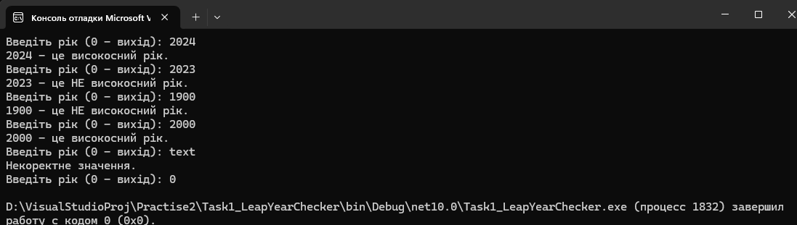

# Task 1: Leap Year Checker


Консольний застосунок для швидкої перевірки року на високосність за григоріанським календарем.

## Принцип роботи

Програма працює у нескінченному циклі `while (true)` і виконує наступні кроки на кожній ітерації:

1. **Введення та зчитування**: показує підказку `Введiть рiк: ` та очікує на введення рядка з консолі.
2. **Валідація**:
   - Метод `int.TryParse` перевіряє, чи є введене значення цілим числом.
   - Якщо введено текст або некоректні символи, програма виводить `"Некоректне значення."` і одразу переходить до наступної ітерації.
3. **Завершення роботи**: якщо користувач вводить `0`, спрацьовує оператор `break`, який перериває цикл і завершує роботу програми.
4. **Алгоритм**:
   - Розраховується булеве значення `isLeap` за формулою: `(year % 400 == 0) || (year % 4 == 0 && year % 100 != 0)`.
   - Рік вважається високосним, якщо він **ділиться на 400 без залишку** або **ділиться на 4, але не ділиться на 100**.
5. **Вивід результату**: залежно від розрахунків `isLeap` у консоль виводиться повідомлення про те, є рік високосним чи ні, після чого цикл повторюється.

## Тестові дані для перевірки

1. **`2024`** — високосний рік (ділиться на 4, але не на 100).
2. **`2023`** — невисокосний рік (не ділиться на 4).
3. **`1900`** — невисокосний рік (ділиться на 100, але не на 400).
4. **`2000`** — високосний рік (ділиться на 400).
5. **`test`** — некоректне введення (перевірка обробки pomylok через `int.TryParse`).
6. **`0`** — завершення роботи програми.

## Приклад роботи



## Запуск (через CLI)

1. Відкрийте термінал і перейдіть у папку з проєктом `Task1_LeapYearChecker`:

   ```bash
   cd Task1_LeapYearChecker
   ```

2. Запустіть програму командою:

   ```bash
   dotnet run
   ```