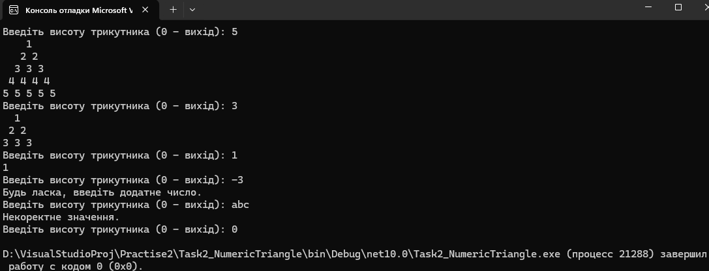

# Task 2: Numeric Triangle


Консольний застосунок для генерації та виводу симетричного числового трикутника (піраміди) заданої користувачем висоти.

## Принцип роботи

Програма працює у нескінченному циклі `while (true)` і виконує наступні кроки на кожній ітерації:

1. **Запит та зчитування**: виводить підказку `Введiть висоту трикутника (0 — вихiд): ` та очікує на введення рядка з консолі.
2. **Валідація типу даних**:
   - `int.TryParse` перевіряє, чи є введене значення цілим числом.
   - Якщо введено текст або некоректні символи, виводиться повідомлення `"Некоректне значення."`.
3. **Умова виходу**: якщо користувач вводить `0`, спрацьовує оператор `break`, який перериває цикл і завершує роботу програми.
4. **Перевірка знака**:
   - Якщо введено від'ємне число, виводиться повідомлення `"Будь ласка, введiть додатне число."`.
   - Якщо введено додатне число (`height > 0`), програма переходить до побудови трикутника.
5. **Алгоритм побудови (вкладені цикли)**:
   - Зовнішній цикл `for i` проходить від `1` до `height` (побудова по рядках).
   - **Пробіли**: перший внутрішній цикл `for j` виводить `height - i` пробілів для центрування рядка та формування форми піраміди.
   - **Числа**: другий внутрішній цикл `for k` виводить поточний номер рядка `i` з пробілом `i` разів.
   - Після завершення рядка `Console.WriteLine()` виконує перехід на новий рядок.

## Тестові дані для перевірки

Щоб перевірити всі гілки логіки та зробити скріншоти:

1. **`5`** — побудова симетричної піраміди з 5 рядків.
2. **`1`** — мінімальний трикутник (одне число `1`).
3. **`-3`** — перевірка обробки від'ємного числа (`Будь ласка, введiть додатне число.`).
4. **`abc`** — перевірка обробки тексту (`Некоректне значення.`).
5. **`0`** — вихід із програми.

## Приклад роботи



## Запуск (через CLI)

1. Відкрийте термінал і перейдіть у папку з проєктом `Task2_NumericTriangle`:
   ```bash
   cd Task2_NumericTriangle
2. Запустіть програму командою:
```bash
dotnet run