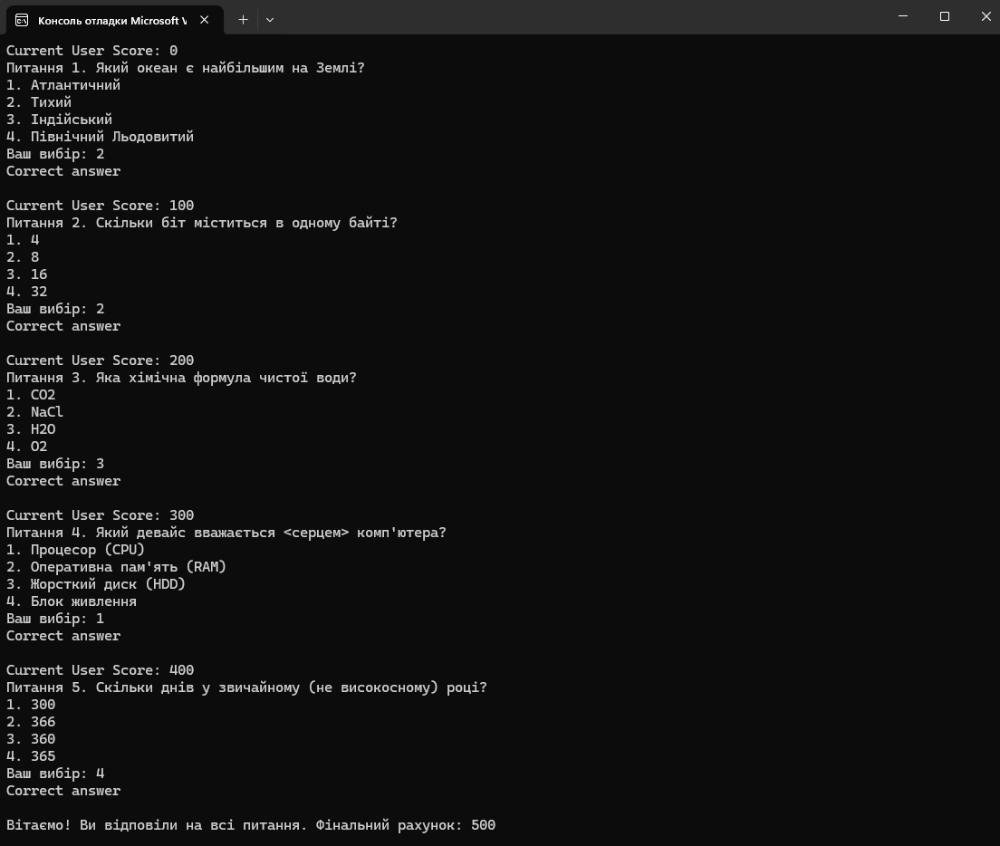
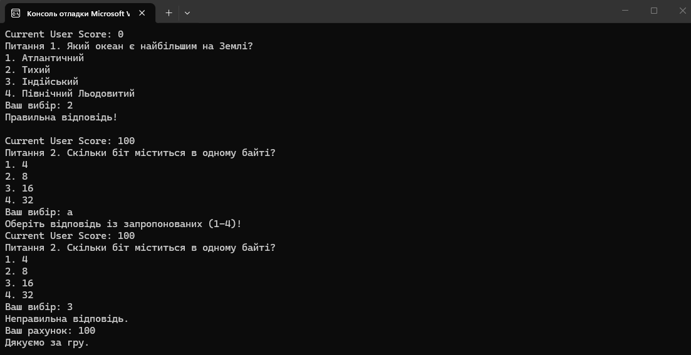

# Task 3: Millionaire Game


Консольний застосунок-вікторина - «Хто хоче стати мільйонером?», де користувач відповідає на серію запитань із варіантами відповідей та накопичує бали.

## Принцип роботи

Гра використовує масиви для збереження питань, варіантів відповідей та правильних ключів:

1. **Дані**:
   - `questions` — одновимірний масив із текстом запитань.
   - `options` — зубчастий масив (`string[][]`), що містить по 4 варіанти відповіді для кожного питання.
   - `correctAnswers` — масив номерів правильних відповідей (від `1` до `4`).
   - `score` — змінна для збереження поточного рахунку (початкове значення `0`).
2. **Ігровий цикл (`for`)**:
   - Почергово виводить поточний рахунок `Current User Score`, номер і текст питання, а також 4 варіанти відповідей.
   - Очікує введення номера відповіді від користувача.
3. **Валідація введення**:
   - За допомогою `int.TryParse` зчитується значення та перевіряється діапазон від `1` до `4`.
   - Якщо введено текст або число поза діапазоном, виводиться підказка `"Оберiть вiдповiдь iз запропонованих (1–4)!"`. Завдяки зменшенню лічильника `i--` та `continue`, питання повторюється без втрати прогресу.
4. **Перевірка відповіді та завершення**:
   - **Правильна відповідь**: виводиться `"Правильна вiдповiдь!\n"`, до `score` додається `100` балів, і гра переходить до наступного питання.
   - **Неправильна відповідь**: виводиться `"Неправильна вiдповiдь."`, підсумковий рахунок та гра достроково завершується оператором `return`.
5. **Перемога**: після успішної відповіді на всі 5 питань виводиться вітальне повідомлення та фінальний рахунок `100 * 5 = 500`.

## Тестові дані для перевірки

Щоб затестити всі сценарії для скріншотів:

1. **Перемога**:
   - Питання 1: `2`
   - Питання 2: `2`
   - Питання 3: `3`
   - Питання 4: `1`
   - Питання 5: `4`
2. **Поразка**:
   - Введіть неправильне число з діапазону 1–4 на будь-якому питанні (наприклад, `1` на першому питанні).
3. **Валідація**:
   - Введіть текст (`abc`) або число поза межами варіантів (`0` чи `5`) — програма попросить повторити введення без завершення гри.

## Приклад роботи

### Перемога


### Поразка + валідація


## Запуск (через CLI)

1. Відкрийте термінал і перейдіть у папку з проєктом `Task3_MillionaireGame`:
   ```bash
   cd Task3_MillionaireGame
2. Запустіть програму командою:
```bash
dotnet run