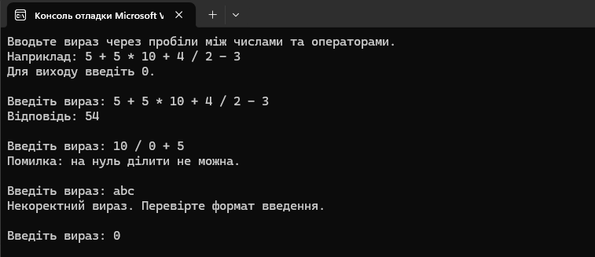

# Task 4: Calculator


Консольний калькулятор простих математичних виразів, який парсить введений рядок та обчислює результат із дотриманням математичного пріоритету операторів (множення та ділення виконуються раніше за додавання та віднімання).

## Принцип роботи

Програма працює у нескінченному циклі `while (true)` та обробляє вирази за двопрохідним алгоритмом:

1. **Введення та розділення**:
   - Очікує на введення виразу через пробіли.
   - Метод `expression.Split(' ')` розбиває рядок на елементи (числа та оператори).
2. **Загальна валідація**:
   - Кількість елементів повинна бути не меншою за 3 та обов'язково непарною (число, оператор, число...).
   - Непарні позиції повинні парситися у `double`, парні — містити оператори `+`, `-`, `*` або `/`.
3. **Двопрохідне обчислення (Пріоритет операцій)**:
   - **Перший прохід (Множення та Ділення)**: проходимо по списку операторів `*` та `/`. Виконується множення або ділення сусідніх чисел у списку `numbers`, після чого обчислений результат записується на місце першого операнда, а другий операнд та використаний оператор видаляються зі списків.
   - **Перевірка ділення на нуль**: якщо виявлено спробу ділення на `0`, виконання виразу переривається з повідомленням `"Помилка: на нуль дiлити не можна."`.
   - **Другий прохід (Додавання та Віднімання)**: послідовно обчислюються операції `+` та `-` над залишками чисел у списку.
4. **Завершення роботи**: при введенні `0` програма завершує свій цикл.

## Тестові дані для перевірки

Щоб перевірити всі сценарії для скріншотів:

1. **Складний вираз із пріоритетом**:
   - Введення: `5 + 5 * 10 + 4 / 2 - 3`
   - Очікуваний результат: `54` (спочатку `5*10=50` та `4/2=2`, потім `5+50+2-3`).
2. **Ділення на нуль**:
   - Введення: `10 / 0 + 5`
   - Повідомлення: `"Помилка: на нуль дiлити не можна."`.
3. **Некоректний формат**:
   - Введення: `5 + + 10` або `abc`
   - Повідомлення: перевірка помилок формату.
4. **Вихід**:
   - Введення: `0`.

## Приклад роботи



## Запуск (через CLI)

1. Відкрийте термінал і перейдіть у папку з проєктом `Task4_Calculator`:
   ```bash
   cd Task4_Calculator
2. Запустіть програму командою:
```bash
dotnet run